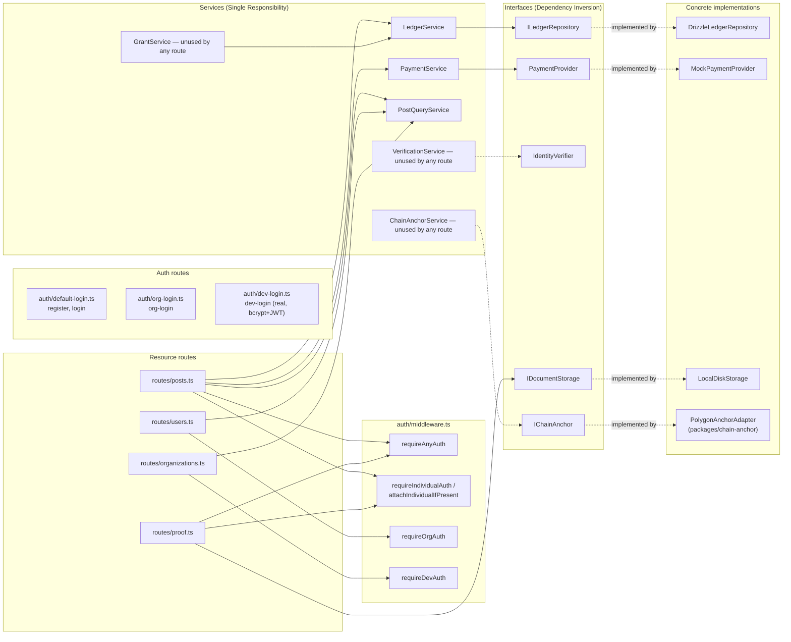
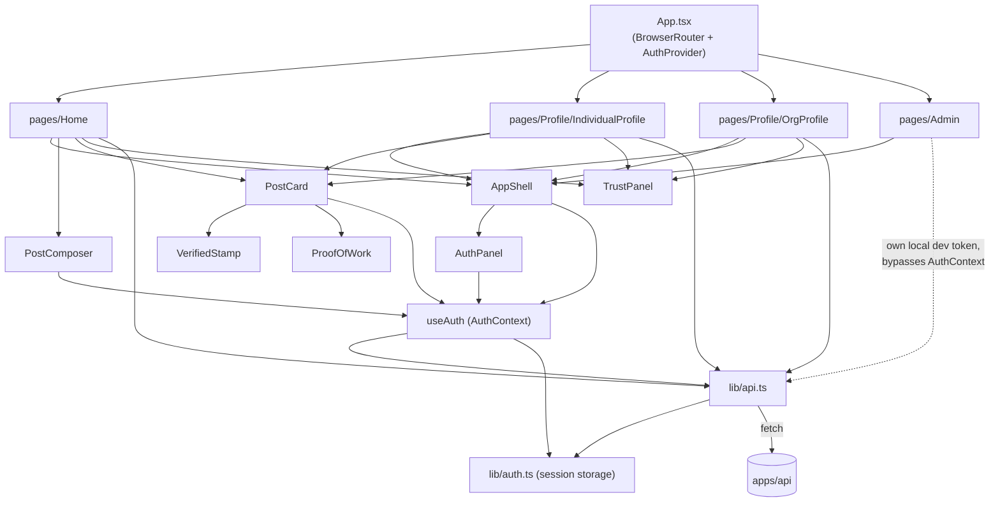

# Architecture

This is the living version of spec section 8 — keep it in sync with
`apps/api/src/interfaces` and `apps/api/src/services` as they change.

## Module dependency graph — who uses what

**Backend.** Solid lines are real, wired dependencies. Dotted lines point
from an interface to its concrete implementation. Note the three greyed
services at the bottom — `VerificationService`, `GrantService`, and
`ChainAnchorService` all exist and typecheck, but no route calls any of
them yet. That's not an oversight; it's an honest map of what's actually
reachable today vs. what's built-but-unwired.

**Frontend.** `Admin` deliberately does *not* go through `AuthContext` —
its dev session lives in its own `sessionStorage` key, kept isolated on
purpose (see "Verification workflow" below).

## Services (Single Responsibility)

| Service | Owns | Does not own |
|---|---|---|
| `VerificationService` | Tier assignment, re-verification | Payments, ledger, grants |
| `LedgerService` | Append-only ledger writes/reads | Payments, chain anchoring |
| `PaymentService` | Charge/refund/webhooks | Payout policy decisions |
| `GrantService` | Application/review/approval workflow | Ledger writes (delegates to `LedgerService`) |
| `ChainAnchorService` | Merkle batching + submission via `IChainAnchor` | Everything else — this is the only module that should ever import a chain SDK |

## Interfaces (Open/Closed + Dependency Inversion)

- `PaymentProvider` — `apps/api/src/interfaces/payment-provider.ts`
- `IdentityVerifier` — `apps/api/src/interfaces/identity-verifier.ts`
- `IChainAnchor` — `apps/api/src/interfaces/chain-anchor.ts` (implementation:
  `@ayudaan/chain-anchor`'s `PolygonAnchorAdapter`)
- `ILedgerRepository` — `apps/api/src/interfaces/ledger-repository.ts`

Adding a new payment rail, verifier, or anchor chain means adding a new
implementation of the relevant interface — not editing the service that
consumes it.

## Auth surfaces (Interface Segregation)

Three logins, three route modules, one JWT-based pattern (each with a
`typ` discriminator baked into the payload, not just a distinct secret —
see the ADR list for why):

- `src/auth/default-login.ts` — individuals (`register`, `login`)
- `src/auth/org-login.ts` — NGOs/Companies; Org Admin vs. Reviewer role is
  resolved via `org_memberships` after login, not by which endpoint was used
- `src/auth/dev-login.ts` — **real now**, not a stub: bcrypt-checks
  `DEV_ADMIN_PASSWORD_HASH`, issues a 2-hour `DevTokenPayload` signed with
  `DEV_JWT_SECRET`. Still isolated on purpose (own file, hard-disabled
  outside dev via `NODE_ENV`), and still a stand-in for a real
  `Platform Staff` role rather than the real thing — see "Verification
  workflow" below.

Four middleware functions cover every combination a route needs:
`requireIndividualAuth` / `attachIndividualIfPresent` (individual-only,
required vs. optional), `requireOrgAuth` (org-only), `requireAnyAuth`
(either — used by `POST /posts` and proof upload, since either kind of
account can author a post), `requireDevAuth` (dev-only, gates the
verification-approval routes).

## Data model

See `apps/api/src/db/schema.ts` — mirrors spec section 5 (verification
tiers), section 7 (grants), and section 9 (append-only ledger, chain
anchor batches). `vouches` is the audit trail for Community-Verified
promotions (see below) — a row per vouch, not just a boolean flip, so
there's a record of which org vouched for whom.

`POST /posts` (create) uses `requireAnyAuth` — either a Default Login or
Organizational Login token — since a post can be authored by an
individual or an org. Whichever token type verifies determines
`authorUserId` vs. `authorOrganizationId`.

**A real bug caught by testing, not typechecking:** `.env.example`
originally gave `JWT_SECRET` and `ORG_JWT_SECRET` the same placeholder
value. `requireAnyAuth` tries verifying a token as an individual token
first, then as an org token — with identical secrets, an org-signed token
"verifies successfully" as an individual token too (same signature key),
just decoded with the wrong assumed shape. An org-authored post was
silently attributed to the org admin's personal account instead of the
organization. Fixed two ways: (1) `jwt.ts` now embeds a `typ:
"individual" | "org"` discriminator in the payload itself, checked after
signature verification, so the two are distinguishable even if the
secrets ever matched again; (2) `env.ts` now fails fast at startup if
`JWT_SECRET === ORG_JWT_SECRET`, and `.env.example`'s two placeholders are
visibly different so nobody copies identical values by accident.

## Proof-of-Work — wired, not stubs

Real file upload via multer (memory storage) → `IDocumentStorage` →
`LocalDiskStorage` (writes to `apps/api/uploads/`, served statically at
`/uploads/*`). SHA-256 is computed from the actual uploaded bytes
server-side, not trusted from the client. `IDocumentStorage` is the same
Open/Closed pattern as `PaymentProvider`/`IChainAnchor` — a production
`S3Storage`/`R2Storage` is a new class behind the same interface, not a
rewrite. EXIF/GPS stripping (spec section 6/9) is **not** done yet —
flagged honestly, not silently skipped.

Only the post's actual author (individual or org) can upload proof —
enforced server-side (`isPostAuthor` check in `routes/proof.ts`), verified
directly: a non-author's upload attempt gets a 403. Community
verification is a deliberate simplification — any logged-in individual
flipping `verifiedByCommunity` to true, not a threshold/voting model.
Fine for demonstrating the mechanic end-to-end; flagged in code comments
as needing a votes table before it's trustworthy at real scale.

**Two real bugs found while wiring this in, both fixed:**
- `PostQueryService.listActive()` was named for filtering but had no
  `WHERE` clause at all — every post showed regardless of status. Once
  flagging existed as a real, reachable state, this would have put
  flagged posts back in the public feed. Fixed: filters to
  `status IN ('active', 'funded')`. Verified: a flagged post disappears
  from `GET /posts` immediately.
- Nothing ever set `status = "funded"`, even though `PostCard` already
  had UI for that state — it was dead code. Fixed in the donate route:
  once `raisedAmount >= requestedAmount`, status flips automatically.
  Verified: donating the full remaining amount flips status and the
  "Fully funded" UI state becomes reachable for the first time.

## Auth — wired, not stubs

`auth/password.ts` (bcrypt) and `auth/jwt.ts` (two secrets — `JWT_SECRET`
for Default Login, `ORG_JWT_SECRET` for Organizational Login, per ADR
0004) back real `POST /register`, `POST /login`, and `POST /org-login`
routes. Token payloads use `userId`, not `sub` — `jsonwebtoken`'s
`JwtPayload` type reserves `sub` as an optional *string*, which collided
with our numeric user id.

`org-login` resolves role via `org_memberships` after password
verification, never before — a user with no membership row gets a 403
regardless of how correct their password is, and a user in multiple orgs
without specifying `organizationId` gets back the list to choose from
rather than an arbitrary pick. Verified directly: a non-member login
attempt 403s, and a real admin login returns a token scoped to exactly
that organization and role.

`attachIndividualIfPresent` (vs. `requireIndividualAuth`) is a deliberate
two-tier middleware: donating stays anonymous-allowed, but a valid Default
Login token attributes the donation to that user. Verified end-to-end —
an authenticated donation shows the donor's real name in
`GET /posts/:id/ledger`; an anonymous one shows `null`.

## Backend routes (`apps/api`) — wired, not stubs

`POST /posts/:id/donate` → `PaymentService.charge` (via `MockPaymentProvider`
for local dev) → `LedgerService.recordDonation` (via
`DrizzleLedgerRepository`, real SHA-256 hash chaining) → `posts.raisedAmount`
updated. `GET /posts` joins `users`/`organizations` via `PostQueryService`
to build the `PublicPost` DTOs the frontend consumes; `GET /posts/:id/ledger`
returns that post's slice of the chain.

The hash chain is **global across the whole `ledger_entries` table**, not
fragmented per post — verified end-to-end: donating to two different posts
in sequence produces entries whose `prevHash`/`hash` link across posts, not
just within one. That's what makes the ledger's integrity a property of
the entire audit log (spec section 9), not of each post in isolation.

`npm run db:seed --workspace=apps/api` populates the same three sample
posts the frontend used to render from mock data, now persisted for real.

**Env loading:** every `apps/api` script runs with `cwd = apps/api` (npm
workspaces convention), but there's a single `.env` at the repo root.
`src/env.ts` loads it explicitly (`config({ path: "../../.env" })`) —
plain `dotenv/config` would silently look for `apps/api/.env`, which
doesn't exist, and every DB call would fail with an unhelpful Postgres
auth error. Found by actually running migrate/seed/serve against a real
Postgres instance, not just by typechecking.

`AuthContext` (React context) holds the current user, backed by
`localStorage` (a real browser app, not an artifact — this is the
standard place for a client-side session token). `AuthPanel` in the nav
shows login/register forms or "Signed in as X" + Log out. `PostComposer`
replaces the old static prompt div — collapsed to a single line until
clicked, and requires login to submit, posting straight to the new
`POST /posts` endpoint and refreshing the feed on success.

## Verification workflow — wired, not stubs

Two separate promotion paths, matching the two tiers that previously had
no assignment mechanism at all (they were only ever set by the seed
script):

**Community-Verified (individual):** `POST /users/:id/vouch`, gated
behind `requireOrgAuth`. The vouching org must itself already hold
Document-Verified or higher (checked server-side, not just implied by the
UI) — an unverified org's vouch attempt gets a 403, verified directly.
The target must currently be `unverified` — already-promoted users get a
409 rather than a silent no-op, so a duplicate click doesn't look like it
succeeded. A `vouches` row records who vouched for whom.

**Document-Verified (organization):** `POST /organizations/:id/verify`,
gated behind `requireDevAuth`. This is the "even a manual
admin-approves-after-reviewing-documents version" — it does not check
Darpan/12A/80G against any real registry (there's no API for that yet);
it records that a human reviewed the org's stated registration numbers
and is vouching they're legitimate. `GET /organizations/pending` lists
everything not yet at Document-Verified or higher, backing the table in
`pages/Admin`.

**Why `requireDevAuth` and not a real admin role:** a proper
`Platform Staff` role — scoped, MFA-gated, living inside the same
identity system as everyone else — is what spec section 9 actually calls
for. That doesn't exist yet; building it means deciding how staff
accounts get provisioned, which is a real design question, not a coding
task to rush. `requireDevAuth` is the honest stand-in for now: it's the
same mechanism already documented as dev-only and isolated, reused rather
than inventing a second parallel "temporary admin" system. Swapping it
for a real role later means changing what `organizations.ts` imports for
its middleware, not its logic.

**One bug caught by testing:** the pending-list filter originally
excluded only `document_verified`, which meant `csr_eligible` orgs — a
*higher* tier — stayed in the "pending" queue forever, since their tier
also technically isn't `document_verified`. Fixed to exclude both tiers;
verified by checking Helping Hands Foundation (seeded as `csr_eligible`)
correctly does not appear in `/organizations/pending`.

## Profile pages & routing

`react-router-dom` was added this round — first real routing in the app.
Four routes: `/` (feed), `/profile/:userId`, `/organizations/:orgId`,
`/admin`.

**Session model.** A browser session is either logged in as an
individual or as an organization, not both — `lib/auth.ts`'s
`StoredSession` is a discriminated union (`{ type: "individual", ... } |
{ type: "org", ... }`), and `AuthContext` exposes it as one `session`
field rather than separate individual/org state. `AuthPanel` gained an
Individual/Organization toggle on top of its existing login/register
tabs; org login has no self-registration (there's no NGO-onboarding flow
built), and handles the multi-org case (`org-login`'s 300 response) with
a picker rather than an error.

`PostCard`'s proof-upload visibility check was extended for this: it used
to only check `user.id === post.authorUserId`; now it checks either that
or `organization.id === post.authorOrganizationId`, matching the backend's
`requireAnyAuth`/`isPostAuthor` pattern that already supported both.

**Individual profile** — Posts / Donations Made / Donations Received
tabs, backed by three new endpoints joining through `ledger_entries` and
`posts`. Shows a "Vouch for this person" button only when the viewer
holds an org session at Document-Verified+ and the profile is
`unverified` — both conditions are re-checked server-side regardless, so
the button's visibility is a UX nicety, not the actual security boundary.

**Org profile** — org's posts + a `TrustPanel` built from real fields
(Darpan ID present, 12A/80G present, CSR-1 registered, verification
tier), not fabricated data.

**Admin** — the only page that doesn't route through `AuthContext`.
Verified end-to-end: registered a fresh user, created a post under their
name, confirmed it appears on their own profile, had a Document-Verified
org vouch for them, and confirmed the profile reflects
`community_verified` immediately after.

## Frontend (`apps/web`)

Design tokens live in `src/styles/tokens.css`; the palette and type pairing
(ink/paper/marigold/verified-green, Fraunces + IBM Plex Sans + IBM Plex
Mono) are chosen to reflect the product's actual claim — audited,
ledger-backed trust — rather than a generic dashboard look. Money and
hashes render in the mono face everywhere (`.mono` utility class) as a
deliberate "this number is on the ledger" signal.

Component map, one directory per component (co-located `.tsx` +
`.module.css`):

| Component | Role |
|---|---|
| `VerifiedStamp` | The one signature element — a rotated ink-stamp ring used everywhere a verification tier is shown, instead of a generic checkmark |
| `TrustPanel` | Trust score + compliance checklist + ledger link — one implementation reused across org/individual/post views (spec Appendix A) |
| `PostCard` | Need-request post, styled as a ledger stub (dashed tear-line, tally-mark progress instead of a gradient bar) |
| `ProofOfWork` | Dual-state proof-of-use module (pending / uploaded), per-entry verify action |
| `PostComposer` | Collapsed prompt → create-post form, individual or org author |
| `AuthPanel` | Individual/Organization login toggle, register, multi-org picker |
| `AppShell` | Left-nav layout shell + routing links |

Pages: `Home` (feed), `Profile/IndividualProfile`, `Profile/OrgProfile`,
`Admin` (dev-login + verification queue, isolated from the rest).

`Home.tsx` fetches from `apps/api` via `src/lib/api.ts` (real `fetch`
calls, no mock data in the render path) and shows an explicit error state
if the API is unreachable, rather than silently falling back to fixtures
— a stale-looking mock feed would be more misleading than a clear "start
the API" message during local dev. `src/data/mock.ts` is kept only for the
sidebar's org list, which has no backing endpoint yet.

`src/data/mock.ts` is dev-only sample data typed against
`@ayudaan/shared-types` — swap for real `fetch` calls to `apps/api` once
the `GET /posts` and ledger endpoints exist; the component props were
written against the shared types specifically so that swap doesn't touch
component code.

## Full context

`docs/spec/ayudaan-spec-v0.3.md` is the source of truth for product
decisions. This file only tracks how the code maps to it.
